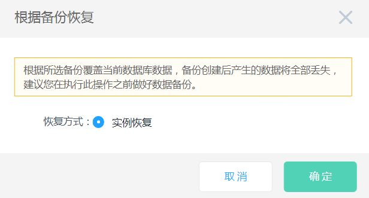
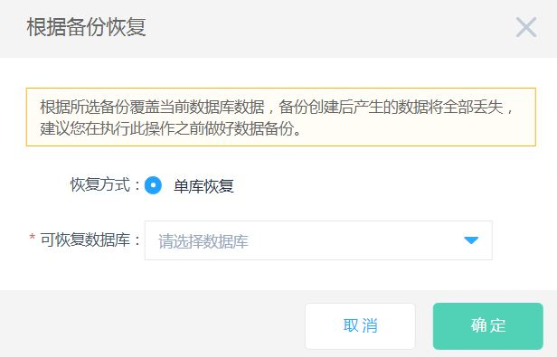
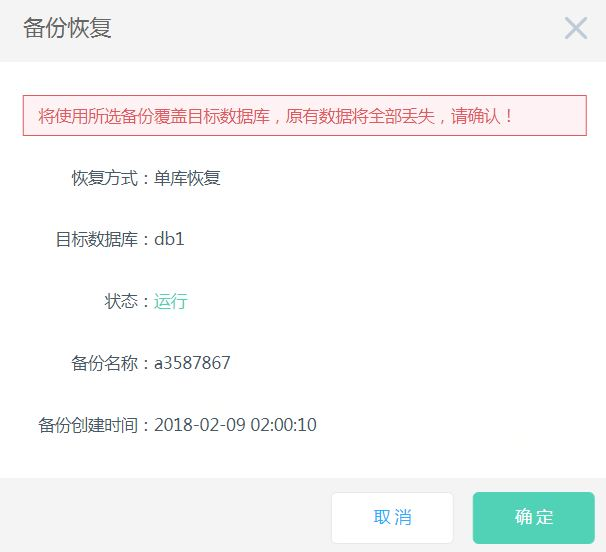

# 实例恢复

## 1. 操作入口
点击备份列表右边的【根据备份恢复】

## 2. 选择恢复方式
**备注：仅SQL Server支持该操作，其他数据库可跳过该步骤** 
1）如果该备份的备份粒度为“实例”，且备份类型为“全量”，则可以选择“实例恢复”还是“单库恢复”

2） 如果备份粒度为“实例”，但备份类型为“增量”，则只能选择“实例恢复”

3）如果备份粒度为“多库”，则只能选择“单库恢复”。在下拉菜单中选择要恢复的数据库。

## 4. 恢复确认
根据选择恢复的类型不同，会弹出下对话框。点击【确认】后，开始恢复。
### SQL Server的确认对话框
**实例恢复** 

**单库恢复** 

## 5. 实例状态
能看到实例状态为“恢复中” （实例恢复）

 或者为“单库备份恢复中”（仅SQL Server）

